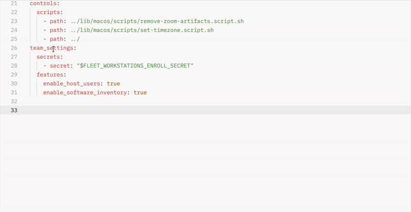

<p align="center">
  
</p>

# Flint - Fleet LSP & GitOps Editor Extensions


**Fl**eet + L**int** — short for Fleet GitOps Editor & Linter — is a language server and linter built for Fleet GitOps YAML.

Flint is an LSP that brings intelligent editor features to any IDE: schema validation, context-aware completions, hover documentation, actionable quick-fixes, and migration tooling to keep manifests correct, consistent, and up to date across repositories.

## Features

- **Validation** — Real-time diagnostics for configuration errors, typos, and misplaced keys
- **Completions** — Context-aware autocompletion for fields, platforms, osquery tables, and file paths
- **Hover Documentation** — Shows docs for Fleet fields and osquery tables
- **Code Actions** — Quick-fixes for deprecated keys and typo corrections
- **Go-to-Definition** — Navigate to referenced files
- **Semantic Highlighting** — SQL syntax highlighting in query fields
- **Deprecation Warnings** — Version-gated warnings with strikethrough on deprecated keys
- **Migration Reports** — JSON-based migration planning for Fleet version upgrades

## Supported Editors

| Editor | Package | Install |
|--------|---------|---------|
| VS Code | [`flint-<version>.vsix`](editors/vscode/) | `code --install-extension flint-0.1.2.vsix` |
| Zed | [Flint extension](editors/zed/) | Install from Zed extension gallery |
| Sublime Text | [Flint LSP](editors/sublime/) | Install via Package Control |
| JetBrains | [Flint plugin](editors/jetbrains/) | Requires `flint` on PATH |
| Neovim | [`require('flint').setup()`](editors/neovim/) | Requires `flint` on PATH |



## Installation

Download packages from [GitHub Releases](https://github.com/headmin/fleet-editor-extensions/releases).

### macOS (PKG installer — signed and notarized)

Download `flint-<version>.pkg` and double-click to install.

### macOS / Linux (script)

```bash
curl -fsSL https://raw.githubusercontent.com/headmin/fleet-editor-extensions/main/scripts/install.sh | sh
```

### From source

```bash
cargo build --release -p flint
sudo cp target/release/flint /usr/local/bin/
```

## Quick start

```bash
flint init            # Create .fleetlint.toml (auto-detects repo structure)
flint check .         # Lint all YAML files
flint check . --fix   # Auto-fix safe issues
flint list-rules      # Show all 18 rules
```

## File Patterns

Supports both v4.83 (`platforms/`) and legacy (`lib/`) Fleet GitOps layouts:

```
default.yml              fleets/*.yml           platforms/**/*.yml
labels/**/*.yml          teams/*.yml (legacy)   lib/**/*.yml (legacy)
```

## Configuration

Create `.fleetlint.toml` in your repo root (or run `flint init`):

```toml
[rules]
disabled = []                        # Rules to skip
warn = ["interval-validation"]       # Downgrade to warnings

[deprecations]
fleet_version = "latest"             # Target Fleet version
future_names = false                 # Opt-in to new naming

[fleet]
url = ""                             # Fleet server URL (optional)
token = ""                           # API token ($ENV_VAR or op://)
gitops_validation = false            # fleetctl --dry-run on save (LSP)
live_completions = false             # Fetch labels/fleets/reports (LSP)
```

## CI Integration

```yaml
- name: Install flint
  run: curl -fsSL https://raw.githubusercontent.com/headmin/fleet-editor-extensions/main/scripts/install.sh | sh
- name: Lint
  run: flint check . --format json
```

## Agent Integration

```bash
flint setup-agent              # Install Claude Code skills
flint help-ai                  # Command reference for agents
flint help-ai --sop migrate   # Migration step-by-step
flint help-json                # Full CLI schema as JSON
```

## Project Structure

```
fleet-editor-extensions/
├── crates/
│   ├── flint-lint/          # Lint engine — 18 rules, schema, config
│   └── flint-lsp/           # LSP server — completions, hover, diagnostics
├── cli/                     # CLI binary (flint)
├── editors/
│   ├── vscode/              # VS Code extension (TypeScript)
│   ├── zed/                 # Zed extension (Rust/WASM)
│   ├── sublime/             # Sublime Text (Python LSP plugin)
│   ├── jetbrains/           # JetBrains (Kotlin plugin)
│   └── neovim/              # Neovim (Lua config)
├── docs/                    # Documentation (Zensical)
├── scripts/                 # Build, install, schema coverage
├── pkg/                     # macOS PKG installer (munkipkg)
└── .devcontainer/           # GitHub Codespaces
```

## Documentation

Full docs at [flint.macadmin.me](https://flint.macadmin.me) (or run `cd docs && uv run zensical serve` locally).

## Building

```bash
# Build binary
cargo build --release -p flint

# Full macOS release (sign + notarize + PKG)
./scripts/build-release.sh --op

# Run tests
cargo test --workspace
```

## License

Apache-2.0
