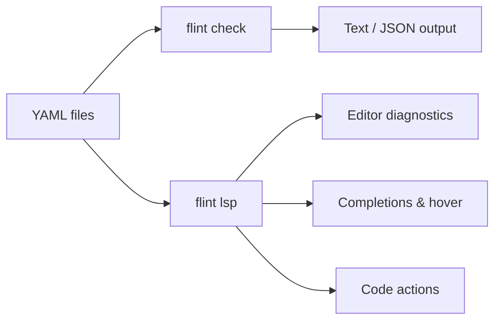

<p align="center">
  
</p>

# Flint

Fleet GitOps YAML linter and language server — catches configuration errors, typos, and misplaced keys *before* `fleetctl gitops` runs.


## What it does

- **18 lint rules** — structural validation, semantic checks, security hygiene, deprecation warnings
- **LSP server** — real-time diagnostics, completions, hover docs, go-to-definition, code actions
- **`--fix`** — auto-apply safe fixes (typo corrections, deprecated key renames)
- **`--format json`** — structured output for CI pipelines
- **Migration reports** — JSON-based migration planning for Fleet version upgrades
- **Agent integration** — `help-ai` progressive discovery for AI-assisted workflows



## Quick start

```bash
# Install (macOS)
curl -fsSL https://raw.githubusercontent.com/headmin/fleet-editor-extensions/main/scripts/install.sh | sh

# Lint a Fleet GitOps repo
flint check .

# Auto-fix safe issues
flint check . --fix

# Initialize configuration
flint init
```

## Editor support

| Editor | Status | Install |
|--------|--------|---------|
| **VS Code** | Full LSP | Install Flint `.vsix` from [releases](https://github.com/headmin/fleet-editor-extensions/releases) |
| **Zed** | Full LSP | Install Flint from Zed extension gallery |
| **Sublime Text** | Full LSP | Install Flint LSP package |
| **JetBrains** | Full LSP | Install Flint plugin |
| **Neovim** | Full LSP | `require('flint').setup()` |

## How it works

Flint validates Fleet GitOps YAML at two levels:

1. **Structural** — unknown keys, misplaced keys, typo suggestions (Levenshtein distance), missing required fields
2. **Semantic** — platform compatibility, label consistency, date formats, secret hygiene, path/glob validation

All validation runs offline with no Fleet server required. The schema is regularly cross-checked against Fleet's Go source for accuracy.
