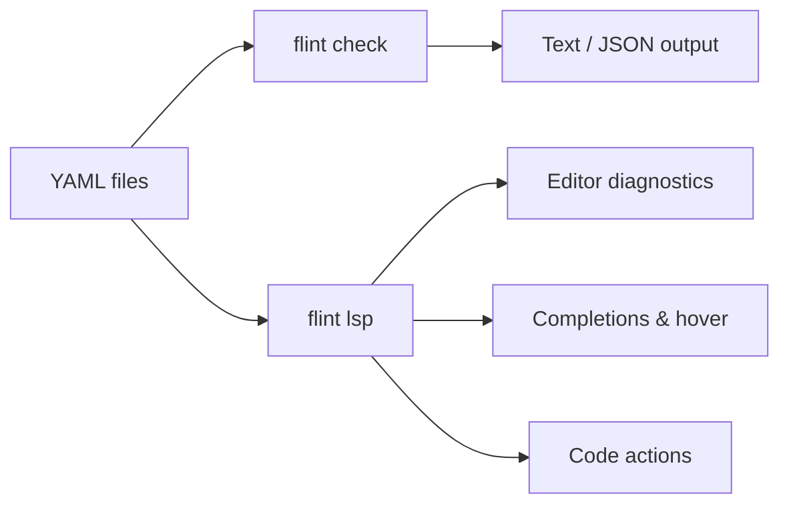

<p align="center">
  
</p>

# Flint

Fleet GitOps YAML linter and language server — catches configuration errors, typos, and misplaced keys *before* `fleetctl gitops` runs.


## What it does

- **18 lint rules** — structural validation, semantic checks, security hygiene, deprecation warnings
- **LSP server** — real-time diagnostics, completions, hover docs, go-to-definition, code actions
- **Migration reports** — JSON-based migration planning for Fleet version upgrades
- **Agent integration** — `help-ai` progressive discovery for AI-assisted workflows



## Quick start

**macOS** — download the signed & notarized PKG:

> [flint-0.1.2.pkg](https://github.com/headmin/fleet-editor-extensions/releases/latest/download/flint-0.1.2.pkg)

**Linux** — install via script:

```bash
curl -fsSL https://raw.githubusercontent.com/headmin/fleet-editor-extensions/main/scripts/install.sh | sh
```

Then:

```bash
# Lint a Fleet GitOps repo
flint check .

# Auto-fix safe issues
flint check . --fix

# Initialize configuration
flint init
```

## Editor support

| Editor | Install |
|--------|---------|
| **VS Code** | Download [flint-0.1.2.vsix](https://github.com/headmin/fleet-editor-extensions/releases/latest/download/flint-0.1.2.vsix) → `Extensions: Install from VSIX` |
| **Zed** | Download [flint-zed-extension-0.1.2.zip](https://github.com/headmin/fleet-editor-extensions/releases/latest/download/flint-zed-extension-0.1.2.zip) → install `flint` binary to PATH |
| **Sublime Text** | Install `flint` binary, add [LSP-flint](editors.md) config |
| **Neovim** | Install `flint` binary, configure as LSP with `cmd = {"flint", "lsp"}` |

## How it works

Flint validates Fleet GitOps YAML at two levels:

1. **Structural** — unknown keys, misplaced keys, typo suggestions (Levenshtein distance), missing required fields
2. **Semantic** — platform compatibility, label consistency, date formats, secret hygiene, path/glob validation

All validation runs offline with no Fleet server required. The schema is regularly cross-checked against Fleet's Go source for accuracy.
